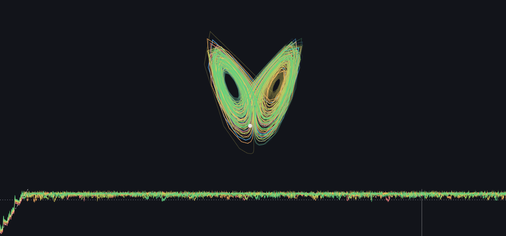
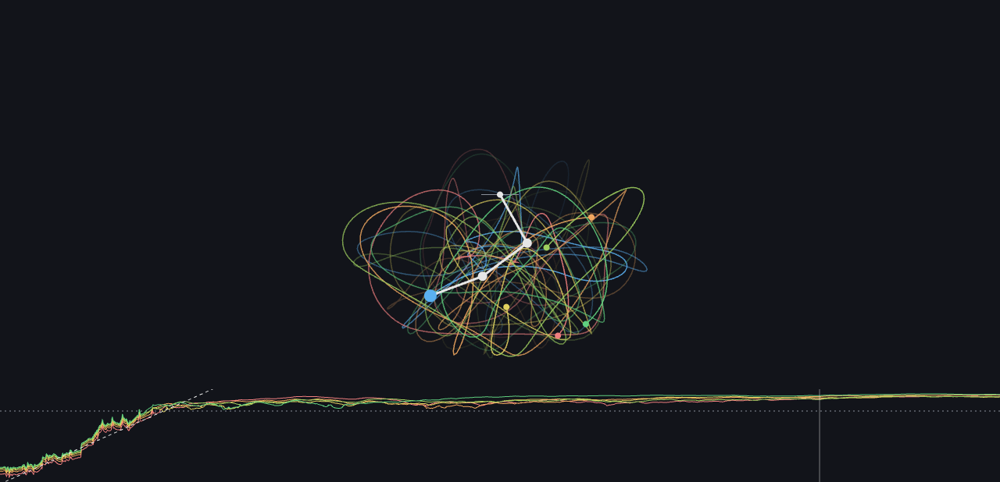
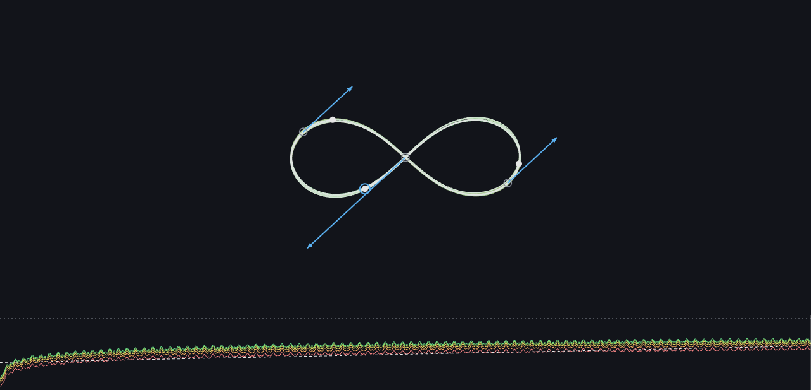

# Deterministic Chaos

## **[Play with it live -> govitpowerz.github.io/teaching-physics-chaos](https://govitpowerz.github.io/teaching-physics-chaos/)**

One experiment, three systems. Take the same equations and the same RK4
integrator, nudge the starting point by one part in a million, and watch the
copies disagree about the future. Every scene runs one reference trajectory
plus K perturbed copies (copy k is offset by k*epsilon); the strip chart under
the canvas plots the log of their state-space separation and fits the largest
Lyapunov exponent live, so you can see the exponential divergence AND its
slope, not just take them on faith.

## The scenes

### Lorenz

The canonical strange attractor at sigma = 10, rho = 28, beta = 8/3, drawn
through a hand-rolled yaw/pitch orthographic projection. Drag empty canvas to
rotate, drag the dot to move the start point in the current view plane, or
type exact x0/y0/z0 coordinates. The default start sits on the attractor, so
the butterfly is fully formed on load. Slide rho below ~24.74 and the strange
attractor dies - that transition is the whole point of the slider. The
divergence slope estimates the largest Lyapunov exponent: canonical 0.906,
on-load fit ~0.84, and a unit test pins the fit inside [0.6, 1.2].

### Pendulum

An n-link pendulum (n = 2..5, unit masses and lengths, g = 1). Grab any joint
to pose the chain - the dragged link aims at the pointer, the links below keep
their relative angles - and release starts it from rest. The ensemble perturbs
the tip angle; tip trails in distinct hues go from indistinguishable to
unrelated. Total energy is displayed live and its drift over the full horizon
is bounded by a unit test.

### N-body

Planar gravity, G = 1, softened kernel. Four presets: the figure-8
choreography, the Pythagorean (Burrau) problem, Sun + 2 planets, and
binary + planet. Bodies and velocity arrows drag; the selected body's position
and velocity can be typed exactly and its mass slides; radii scale as
mass^(1/3). The ensemble perturbs the selected body's position. Energy and
angular momentum readouts keep the integrator honest.

Shared everywhere: a K slider (2..10 copies), a log-scale perturbation size,
and playback (play/pause, reset, scrubber, speeds up to 16x) over long
precomputed horizons (400 time-units for Lorenz, 300 for the pendulum,
200..600 per n-body preset). Trails fade with age: the recent stretch stays
bright while the deep past dims away, and the paused start state shows the
whole trajectory as a faint map. Scrubbing back to the exact moment the
copies split costs nothing.

## Quick start

    npm install
    npm run dev       # dev server on :5173
    npm test          # vitest over the sim core, ensemble math, store, formatters
    npm run build     # tsc --noEmit + vite build -> dist/

## How it works

One fixed-step RK4 integrator (`src/sim/ode.ts`) advances flat `number[]`
states: Lorenz is 3 numbers, the n-link pendulum 2n, the planar n-body 4n.
`simulate()` (`src/sim/simulate.ts`) records a bounded sample table (tMax, a
sample cap, a recording stride - it integrates at full dt for accuracy but
stores every k-th sample to keep the long horizons cheap - nonfinite
truncation at the last good sample, and an optional halt predicate - n-body
ensemble members that fly beyond three times the preset's half-extent
truncate early and freeze at their last sample during playback; at the new
600-unit horizon the Pythagorean problem genuinely ends this way, with its
famous ejection near t ~ 92);
playback and trails interpolate the same samples, so they cannot disagree.
`src/sim/ensemble.ts` builds the perturbed copies (delta0 = k*epsilon is known
exactly), measures full-state L2 separation, and fits lambda by log-linear
regression below a saturation cutoff (a fixed fraction of the reference
trajectory's state-space extent). The pendulum solves M(theta) * omegaDot = b
by Gaussian elimination with partial pivoting each derivative call; the n-body
uses the softened kernel (r^2 + 0.05^2)^(3/2). The pure core never throws:
clamps, stop conditions, and truncation instead of exceptions.

The claims in the captions are test-enforced, not decorative: the fitted
Lorenz lambda must land in [0.6, 1.2], pendulum energy drift stays under 1e-4
over the full horizon, n-body energy and angular momentum are conserved to
tolerance, and the figure-8 returns near its start after one period.

Sibling project: **Motion in Force Fields** (`../kinematics`), which this repo
borrows its stack and conventions from.

## Deploy

Pushing to `main` runs `.github/workflows/deploy.yml`: npm ci, vitest, Vite
build, then GitHub Pages deploy of `dist/` to the live URL above. One-time
setup: repository Settings -> Pages -> Source: GitHub Actions.
